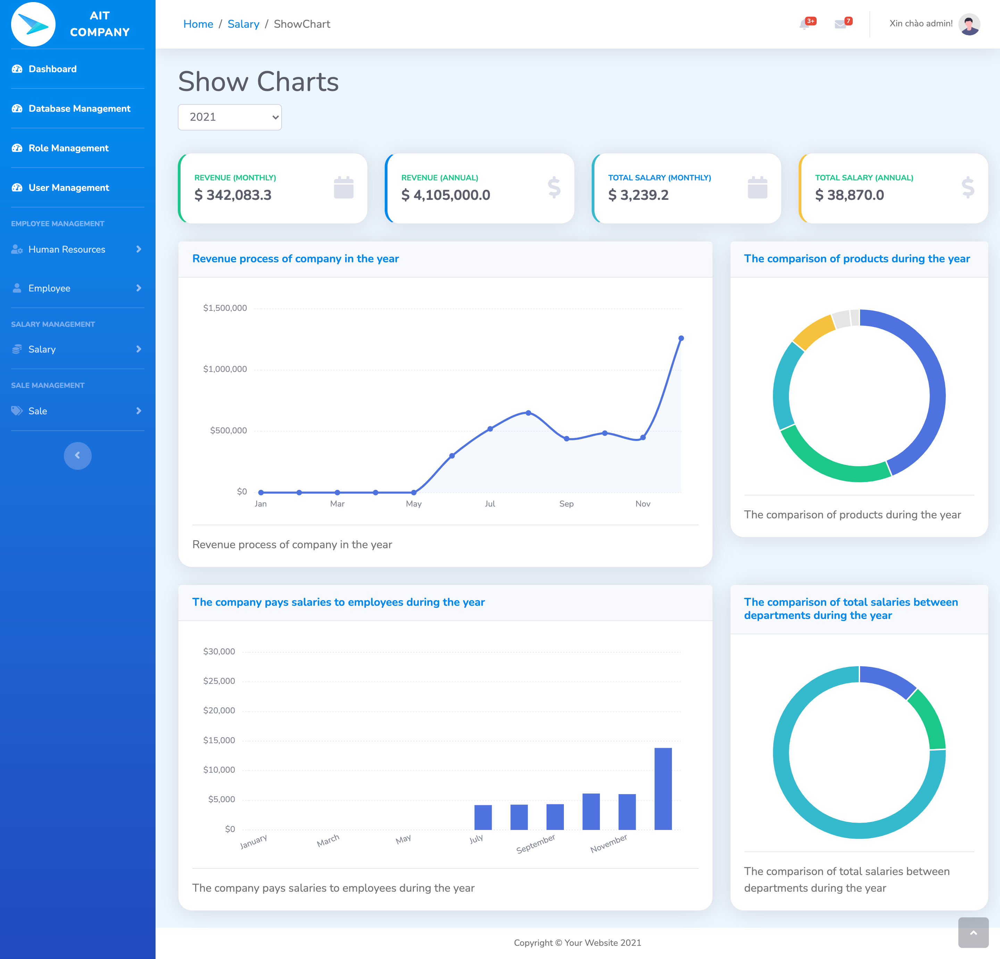
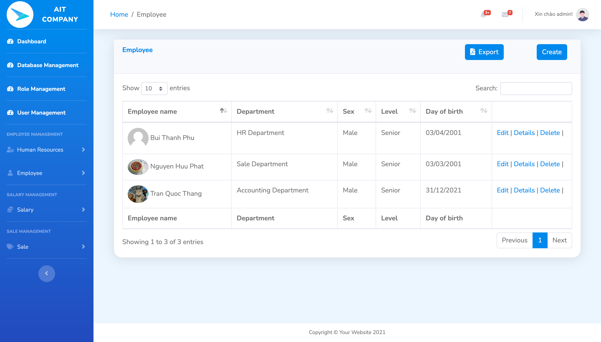
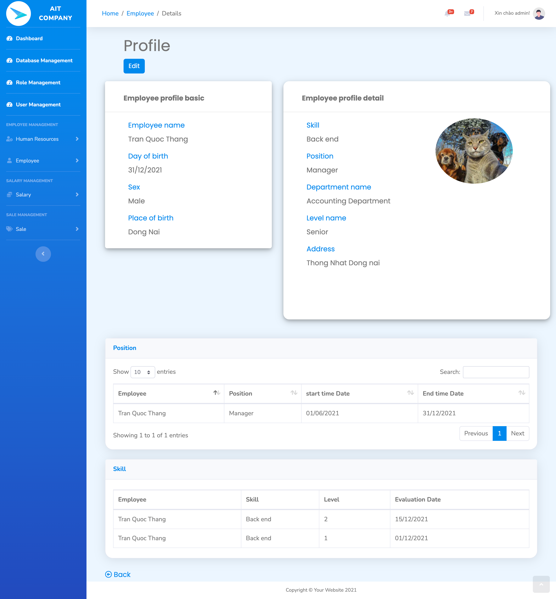
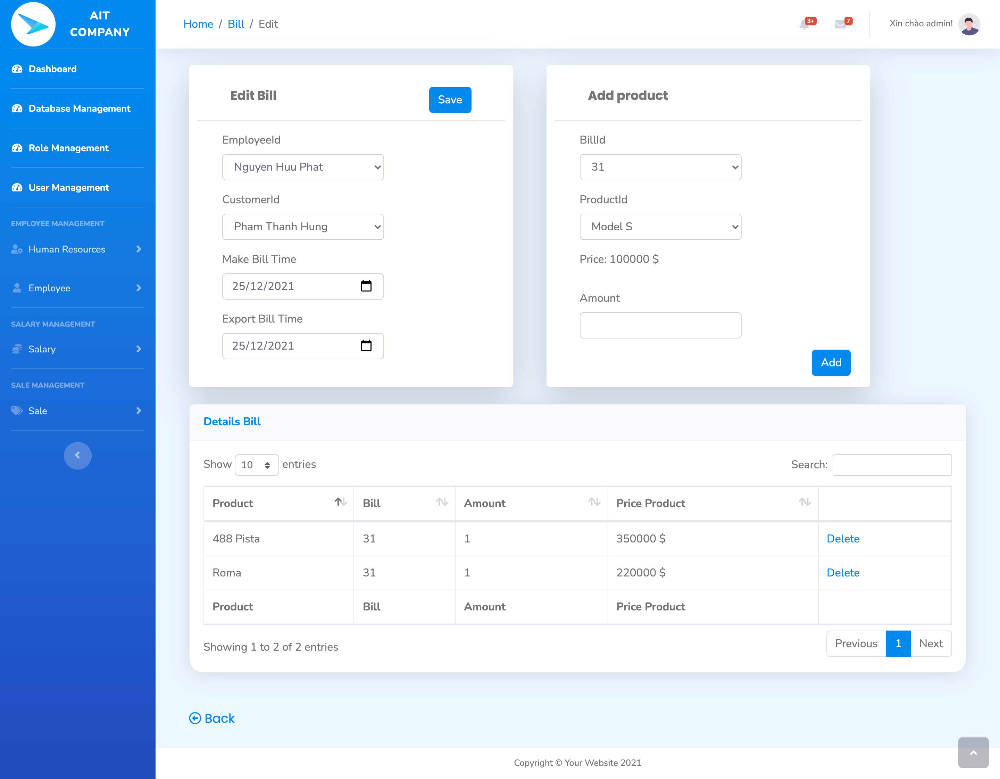

  
# AIT Business management system      

## Table of Contents
* [Introduction](#introduction)
* [Technologies Used](#technologies-used)
* [Features](#features)
* [Deployment](#deployment)
* [How to install and run the project](#how-to-install-and-run-the-project)
* [Usage](#usage)
* [Acknowledgements](#acknowledgements)
* [AIT Team](#ait-team)
<!-- * [License](#license) -->


## Introduction
In each company, there is a separate way of doing business, but the operations are relatively similar (HR, product management, finance, engineering,...). These operations to do on paper are easy to lead to errors, data loss, which takes a lot of time as well as is not focused, easy to repeat many times. Understanding these requirements, AIT company wants to build a software to manage the company's business system to meet the basic tasks.





## Technologies Used
Your Web application should use the following technologies, frameworks and development techniques:

- ASP.NET MVC
- MS SQL Server as database back-end
- Entity Framework to access database
- Bootstrap SB Admin2 
- The standard ASP.NET Identity System for managing users and roles
- AJAX communication in some parts of web application
- Apply error handling and data validation to avoid crashes when invalid data is entered


## Features
A few of the things you can do with AIT Business management system:
- Register
- Login
- Manage account
- Manage employee
- Manage employee skills
- Manage employee positions
- Manage salary
- Manage customer
- Manage product
- Manage product type
- Manage supplier
- Manage billSetup

> EmployeeManagement Page



> Profile Page



> Bill Creation Page



## Deployment
Web is deploying on [AIT Bussiness Management System](http://lucasuit-001-site1.etempurl.com/) until Feb 13, 2022. After that date, this link will be disable. 
Please run it on localhost with below step!
## How to install and run the project
To clone and run this application, you'll need [.Net Framework](https://dotnet.microsoft.com/en-us/download/dotnet-framework), [Visual Studio](https://visualstudio.microsoft.com/) and [MS SQL Server Management Studio](https://docs.microsoft.com/en-us/sql/ssms/download-sql-server-management-studio-ssms?view=sql-server-ver15) installed on your computer. 

You might want to look into `appsettings.json` to make change connection string: 
```
"AppMvcConnectionString" : "Data Source=[YourComputer];Initial Catalog=[YourDatabaseName];User Id=[YourUserID];Password=[YourPassWord];"
```


After that your command line will be in terminal:
- `dotnet restore` 
- `dotnet ef database update`
- `dotnet watch run`


## Usage
After you clone this repo to your desktop, go to its root directory and run `dotnet restore` to install its dependencies.
Once the dependencies are installed, you can run `dotnet watch run` to start the application. You will then be able to access it at localhost:5000


## Acknowledgements
- Thanks to [Microsoft](https://www.microsoft.com/vi-vn/) for supporting us with Asp.net documentation
- Thanks to [stackoverflow](https://stackoverflow.com/) for supporting us 


## AIT Team
<!-- [](https://github.com/LucasTran-tq) | 
[](https://github.com/nguyenhuuphat2001) | 
[](https://github.com/phubuideptrai) | 
---|--- -->

- [Tran Quoc Thang](https://github.com/LucasTran-tq)
- [Nguyen Huu Phat](https://github.com/nguyenhuuphat2001)
- [Bui Thanh Phu](https://github.com/phubuideptrai)


<!-- Optional -->
<!-- ## License -->
<!-- This project is open source and available under the [... License](). -->

<!-- You don't have to include all sections - just the one's relevant to your project -->
